# Architecture & Technology Stack - KisanSaathi (ਕਿਸਾਨ ਸਾਥੀ)

This document details the system design, user flows, database structures, and artificial intelligence agents of the KisanSaathi platform.

---

##  Technology Stack Breakdown

### 1. AI / Model Layer
*   **Google Gemini 3.5 Flash (`gemini-3.5-flash`)**: Core LLM used for high-speed, multi-lingual natural language generation, semantic voice agent replies, and database-free intent parsing.
*   **Gemini 1.5 Vision (Multimodal)**: Used for automated inspection of crop damage images. Given a base64 crop image, the model extracts the crop type, disease/pest type, severity scale, and filing recommendations.
*   **Dynamic System Instructions**: Structured prompts deployed directly to Gemini context to guide intent classification, weather threat assessments, and crop insurance recommendations.

### 2. Agents & Automation
*   **Voice Assistant Agent (`src/services/voice.js`)**: Leverages the browser-native **Web Speech API** for Speech-to-Text (STT) and Text-to-Speech (TTS). Supports English (`en-IN`), Hindi (`hi-IN`), and Punjabi (`pa-IN`) speech patterns.
*   **Intent Classification Agent (`src/services/gemini.js`)**: Classifies farmer utterances into structured intents: `CLAIM_START`, `POLICY_QUESTION`, `RISK_QUESTION`, `FARMING_ADVICE`, `GREETING`, and `OTHER` to drive intelligent screen routing.
*   **Agricultural Risk Analyst Agent**: Maps location (district) and daily weather variables to determine probabilities for regional threats like Whitefly infestations, Pink Bollworms, or groundwater droughts.
*   **Insurance Advisor Agent**: Matches crop characteristics, regional risks, and government subsidies (e.g., PMFBY vs. RWBCIS) to output a tailored financial protection plan.

### 3. Application & Backend Stack
*   **Frontend**: React 18, Vite (fast HMR bundling), and Tailwind CSS for utility-first styling.
*   **Icons**: Lucide React.
*   **State & Translation**: React Context (`LanguageContext.jsx`) managing localized dictionary lookups.
*   **Database & Authentication**: Firebase Firestore for cloud persistence + Firebase Authentication (Anonymous Sign-In).
*   **Offline Fallback Engine (`src/services/firebase.js`)**: A complete dual-write `localStorage` fallback layer. If Firestore is offline or unconfigured, the app reads and writes to local cache seamlessly, keeping the UI fully operational.

### 4. Cloud & Public APIs
*   **Open-Meteo Weather API**: Fetches hourly/daily wind speeds, humidity, rainfall, and max/min temperatures for coordinates.
*   **6-Hour Weather Cache**: Restricts API calls by storing forecasts in `localStorage` with a 6-hour expiration timestamp.

---

##  Comprehensive System Flowchart

The diagram below details the entire application structure, including initialization, multi-lingual navigation, offline caching, and the AI agent loop.

```mermaid
flowchart TD
    %% Base Styles
    classDef startClass fill:#16a34a,stroke:#14532d,stroke-width:2px,color:#fff;
    classDef pageClass fill:#f0fdf4,stroke:#16a34a,stroke-width:2px,color:#14532d;
    classDef serviceClass fill:#fef08a,stroke:#ca8a04,stroke-width:2px,color:#713f12;
    classDef aiClass fill:#dbeafe,stroke:#2563eb,stroke-width:2px,color:#1e40af;
    classDef cacheClass fill:#ffedd5,stroke:#ea580c,stroke-width:2px,color:#7c2d12;
    classDef offlineClass fill:#f3f4f6,stroke:#4b5563,stroke-width:2px,color:#1f2937;

    %% Entry Points
    Start([Farmer Enters Website]) --> Landing[Landing Page: Landing.jsx]:::pageClass
    Landing --> LangChoose{Select Language}
    LangChoose -- Punjabi --> SetPa[Set Language 'pa']
    LangChoose -- Hindi --> SetHi[Set Language 'hi']
    LangChoose -- English --> SetEn[Set Language 'en']
    
    SetPa & SetHi & SetEn --> InitAuth[Authenticate Farmer: firebase.js]:::serviceClass

    %% Auth & Cache Flow
    InitAuth --> CheckConfig{Is Firebase Configured?}
    CheckConfig -- Yes --> AuthFirebase[Firebase Anonymous Sign-In]:::serviceClass
    CheckConfig -- No --> AuthLocal[Generate Local Mock UID & Cache]:::cacheClass
    
    AuthFirebase & AuthLocal --> RegisterUID[Store UID in localStorage: kisan_current_uid]:::cacheClass
    RegisterUID --> CheckProfile{Does Profile Exist?}
    
    CheckProfile -- No --> Onboarding[Onboarding Page: Onboarding.jsx]:::pageClass
    CheckProfile -- Yes --> Dashboard[Dashboard Page: Dashboard.jsx]:::pageClass
    
    %% Onboarding Input
    Onboarding --> InputProfile[Enter Name, Aadhaar, District, Primary Crop, Land Size]
    InputProfile --> SaveProfile[Save Profile: saveFarmerProfile]:::serviceClass
    SaveProfile --> SaveDB{Firebase Configured?}
    SaveDB -- Yes --> WriteFirestore[Write to Firestore 'farmers' Collection]:::serviceClass
    SaveDB -- No --> WriteLocalCache[Write to localStorage: kisan_profile_uid]:::cacheClass
    WriteFirestore & WriteLocalCache --> Dashboard
    
    %% Dashboard Flow
    Dashboard --> LoadProfile[Fetch Profile details]:::serviceClass
    LoadProfile --> ParallelCalls[Trigger Parallel API Requests]
    
    %% Weather Cache Flow
    ParallelCalls --> FetchWeather[Weather Request: getWeatherForecast]:::serviceClass
    FetchWeather --> CheckWeatherCache{Weather cached & < 6 hours old?}
    CheckWeatherCache -- Yes --> UseCachedWeather[Load cached weather data]:::cacheClass
    CheckWeatherCache -- No --> CallOpenMeteo[Fetch from Open-Meteo REST API]:::serviceClass
    CallOpenMeteo --> SaveWeatherCache[Cache weather with Timestamp]:::cacheClass
    UseCachedWeather & SaveWeatherCache --> RenderWeatherCard[Render 14-day Weather Dashboard]
    
    %% Risk Agent Flow
    ParallelCalls --> FetchRisk[Call Risk Agent: callGemini]:::aiClass
    FetchRisk --> SendRiskPrompt[Prompt: Analysing crop risk for crop + district + weather]
    SendRiskPrompt --> RunRiskAI{Is Gemini API Key Present?}
    RunRiskAI -- Yes --> CallGeminiRisk[Fetch live Gemini JSON Response]:::aiClass
    RunRiskAI -- No --> RunMockRisk[Load Localised Punjab/Malwa Mock Threats]:::cacheClass
    CallGeminiRisk & RunMockRisk --> ExtractRiskJSON[Extract JSON & Parse Structure]:::serviceClass
    ExtractRiskJSON --> RenderRiskPanel[Display Risk Level, Score, Top Threats & Sowing Advice]

    %% Voice Assistant Agent Flow
    Dashboard --> ClickVoice[Navigate to Voice Agent: Chat.jsx]:::pageClass
    ClickVoice --> SpeechInit{Browser supports Web Speech API?}
    SpeechInit -- Yes --> ListenUser[Active Listening: startListening]:::serviceClass
    SpeechInit -- No --> ManualTextInput[Enable Standard Text Input Chat]
    
    ListenUser --> SpeakWords[Farmer Speaks in pa/hi/en]
    SpeakWords --> STTConvert[Web Speech STT: Convert Speech to Text]:::serviceClass
    STTConvert --> IntentAgent[Intent Classification Agent: callGemini]:::aiClass
    IntentAgent --> ClassifyIntent{Determine Farmer Intent}
    
    ClassifyIntent -- CLAIM_START --> RedirectClaim[Redirect to Claim Filing Page]
    ClassifyIntent -- POLICY_QUESTION --> RedirectPolicy[Redirect to Policy Advisor Page]
    ClassifyIntent -- RISK_QUESTION | FARMING_ADVICE | GREETING --> GenerateAIAnswer[Generate Conversational Response]:::aiClass
    ClassifyIntent -- OTHER --> GenerateAIAnswer
    
    GenerateAIAnswer --> TTSConvert[Web Speech TTS: Speak Response Out Loud]:::serviceClass
    TTSConvert --> UpdateChatWindow[Append to Conversation Bubble UI]
    
    %% Policy Recommendation Flow
    Dashboard --> ClickPolicy[Navigate to Policy Advisor: PolicyAdvisor.jsx]:::pageClass
    ClickPolicy --> LoadPolicyData[Query Advisor Agent: callGemini]:::aiClass
    LoadPolicyData --> MatchPolicyPrompt[Match Crop & District against PMFBY, RWBCIS, UPIS, Kshema]
    MatchPolicyPrompt --> RunPolicyAI{Is Gemini API Key Present?}
    RunPolicyAI -- Yes --> CallGeminiPolicy[Fetch Recommended Policy JSON]:::aiClass
    RunPolicyAI -- No --> FallbackPolicy[Return Mock Recommendation: RWBCIS for Cotton / PMFBY for Wheat]:::cacheClass
    CallGeminiPolicy & FallbackPolicy --> RenderRecommendation[Display Recommended Policy Card, Reason, Premium & Coverage]
    RenderRecommendation --> EnrollAction[Farmer Clicks Enroll]
    EnrollAction --> SaveEnrollment[Update Profile enrolledPolicy field]:::serviceClass
    SaveEnrollment --> SyncProfileDB{Firebase Configured?}
    SyncProfileDB -- Yes --> FirestoreUpdate[Update Firestore Document]:::serviceClass
    SyncProfileDB -- No --> LocalUpdate[Update localStorage: kisan_profile_uid]:::cacheClass
    FirestoreUpdate & LocalUpdate --> UpdateNavbarName[Navbar Profile Indicator Updates]
    
    %% Claim Filing & Vision Flow
    Dashboard & RedirectClaim --> ClickClaim[Navigate to Claim Filing: ClaimFiling.jsx]:::pageClass
    ClickClaim --> ClaimStep1[Step 1: Enter Crop Damage details & Date]
    ClaimStep1 --> CapturePhoto[Upload/Capture Crop Leaf Image]
    CapturePhoto --> Base64Conv[Convert Image to Base64 String]:::serviceClass
    
    Base64Conv --> ClaimStep2[Step 2: Vision Analysis: callGeminiVision]:::aiClass
    ClaimStep2 --> VisionKeyCheck{Is Gemini API Key Present?}
    VisionKeyCheck -- Yes --> CallGeminiVisionAPI[Send Base64 + Prompts to Gemini Vision]:::aiClass
    VisionKeyCheck -- No --> VisionMockFallback[Return Pest: Whitefly, Severity: Severe, Conf: 95%]:::cacheClass
    CallGeminiVisionAPI & VisionMockFallback --> RenderVisionResult[Display Analysis: Identified Crop, Damage Type, Severity, AI Notes]
    
    RenderVisionResult --> ClaimStep3[Step 3: Auto-fill bank, Aadhaar, select policy]
    ClaimStep3 --> SubmitClaim[Submit Claim: saveClaim]:::serviceClass
    SubmitClaim --> DBClaimSync{Firebase Configured?}
    DBClaimSync -- Yes --> WriteFirestoreClaim[Save to claims Collection + Cache locally]:::serviceClass
    DBClaimSync -- No --> WriteLocalClaim[Save to localStorage: kisan_claims_uid]:::cacheClass
    
    WriteFirestoreClaim & WriteLocalClaim --> ClaimSuccess[Filing Success Screen]
    ClaimSuccess --> LaunchCountdown[Start 72-Hour Claim Filing Deadline Countdown]:::serviceClass
    
    %% Claim Status Tracker Flow
    Dashboard & RedirectPolicy --> ClickTracker[Navigate to Claim Tracker: ClaimTracker.jsx]:::pageClass
    ClickTracker --> FetchClaimsList[Load Claims: getClaims]:::serviceClass
    FetchClaimsList --> DBCClaimsSync{Firebase Configured?}
    DBCClaimsSync -- Yes --> FetchFirestoreClaims[Get from Firestore & Cache locally]:::serviceClass
    DBCClaimsSync -- No --> FetchLocalClaims[Get from localStorage: kisan_claims_uid]:::cacheClass
    
    FetchFirestoreClaims & FetchLocalClaims --> RenderClaimList[Render List of Active Claims]
    RenderClaimList --> ClickClaimDetail[View Selected Claim Detail Timeline]
    ClickClaimDetail --> DisplayTimeline[Timeline Status Steps: Filed -> Under Review -> Approved -> Disbursed]
    DisplayTimeline --> ClaimActionStatus[Display Countdown Timer or Disbursement Progress]
```

