# KisanSaathi Technical Whitepaper and Project Documentation
> Comprehensive system design, model implementation, localization mechanics, and architectural approach.

KisanSaathi is an agentic AI companion designed for Indian farmers. The application predicts localized agricultural risks, provides crop insurance advisory, scans government documents via AI vision, and generates ready-to-submit official policy applications as PDFs—all via voice in Punjabi, Hindi, and English.

---

## 1. Executive Summary

Indian agriculture represents the primary livelihood for over 146 million farmers. However, the farming community is highly vulnerable to climate anomalies, localized weather extremes, pest outbreaks, and consequent financial instability. While the government of India offers comprehensive crop insurance schemes like PMFBY (Pradhan Mantri Fasal Bima Yojana) and RWBCIS (Restructured Weather Based Crop Insurance Scheme), enrollment remains critical: less than 10% of farmers in vulnerable regions like Punjab are enrolled.

The primary friction points preventing widespread insurance adoption are:
* **Linguistic Barriers:** Existing registration portals are presented in English or formal Hindi, which is inaccessible to rural farmers speaking regional dialects or Gurmukhi Punjabi.
* **Complex Data Entry:** Portals require manual typing of detailed land revenue details, bank accounts, and identification numbers, introducing high digital friction.
* **Claim Deadline Windows:** Claims for weather-induced crop damage must be submitted within a strict 72-hour window, requiring immediate diagnosis, document compiling, and notice filing that most farmers fail to execute in time.

KisanSaathi resolves these barriers by implementing a zero-typing, voice-first mobile web application. By combining browser-native Web Speech APIs with multimodal Gemini 3.1 Flash Lite models, farmers can enroll in policy plans, scan Jamabandi land records and Aadhaar cards, obtain localized agronomic risk forecasts, and file crop damage claims entirely in Punjabi, Hindi, or English.

---

## 2. Core Technology Stack and Specifications

The application is built on an lightweight, client-side architecture that minimizes server overhead and latency:

* **Vite + React 18:** Serves as the frontend application framework, optimized for rapid rendering and lightweight builds.
* **TailwindCSS:** Provides responsive layout systems and curated, high-contrast visual tokens suited for outdoor, daylight usability.
* **Gemini 3.1 Flash Lite (`gemini-3.1-flash-lite`):** Utilized for text processing, zero-shot structured JSON document extraction, risk synthesis, and multi-lingual dialog generation.
* **Web Speech API:** Implements browser-native Speech-to-Text (STT) and Text-to-Speech (TTS) interfaces, avoiding the costs and latency of third-party voice APIs.
* **jsPDF:** Compiles structural PDF application forms, stitches coordinates, encodes images, and triggers downloads client-side.
* **Firebase Spark Tier (Firestore + Anonymous Auth):** Provides cloud-backed data persistence, database transactions, and background syncing.
* **Open-Meteo REST API:** Fetches free, coordinate-based 14-day weather forecasts without requiring API keys.

---

## 3. Comprehensive System Flowchart

The following diagram illustrates the complete execution flow of the KisanSaathi application, spanning initialization, multi-lingual configuration, database check-ins, local storage caching, voice-controlled page routing, OCR extraction, and PDF generation:

```mermaid
flowchart TD
    %% Base Styles
    classDef startClass fill:#16a34a,stroke:#14532d,stroke-width:2px,color:#fff;
    classDef pageClass fill:#f0fdf4,stroke:#16a34a,stroke-width:2px,color:#14532d;
    classDef serviceClass fill:#fef08a,stroke:#ca8a04,stroke-width:2px,color:#713f12;
    classDef aiClass fill:#dbeafe,stroke:#2563eb,stroke-width:2px,color:#1e40af;
    classDef cacheClass fill:#ffedd5,stroke:#ea580c,stroke-width:2px,color:#7c2d12;
    classDef offlineClass fill:#f3f4f6,stroke:#4b5563,stroke-width:2px,color:#1f2937;

    %% Entry Points
    Start([Farmer Enters Website]) --> Landing[Landing Page: Landing.jsx]:::pageClass
    Landing --> LangChoose{Select Language}
    LangChoose -- Punjabi --> SetPa[Set Language 'pa']
    LangChoose -- Hindi --> SetHi[Set Language 'hi']
    LangChoose -- English --> SetEn[Set Language 'en']
    
    SetPa & SetHi & SetEn --> InitAuth[Authenticate Farmer: firebase.js]:::serviceClass

    %% Auth & Cache Flow
    InitAuth --> CheckConfig{Is Firebase Configured?}
    CheckConfig -- Yes --> AuthFirebase[Firebase Anonymous Sign-In]:::serviceClass
    CheckConfig -- No --> AuthLocal[Generate Local Mock UID & Cache]:::cacheClass
    
    AuthFirebase & AuthLocal --> RegisterUID[Store UID in localStorage: kisan_current_uid]:::cacheClass
    RegisterUID --> CheckProfile{Does Profile Exist?}
    
    CheckProfile -- No --> Onboarding[Onboarding Page: Onboarding.jsx]:::pageClass
    CheckProfile -- Yes --> Dashboard[Dashboard Page: Dashboard.jsx]:::pageClass
    
    %% Onboarding Input
    Onboarding --> InputProfile[Enter Name, Aadhaar, District, Primary Crop, Land Size]
    InputProfile --> SaveProfile[Save Profile: saveFarmerProfile]:::serviceClass
    SaveProfile --> SaveDB{Firebase Configured?}
    SaveDB -- Yes --> WriteFirestore[Write to Firestore 'farmers' Collection]:::serviceClass
    SaveDB -- No --> WriteLocalCache[Write to localStorage: kisan_profile_uid]:::cacheClass
    WriteFirestore & WriteLocalCache --> Dashboard
    
    %% Dashboard Flow
    Dashboard --> LoadProfile[Fetch Profile details]:::serviceClass
    LoadProfile --> ParallelCalls[Trigger Parallel API Requests]
    
    %% Weather Cache Flow
    ParallelCalls --> FetchWeather[Weather Request: getWeatherForecast]:::serviceClass
    FetchWeather --> CheckWeatherCache{Weather cached & < 6 hours old?}
    CheckWeatherCache -- Yes --> UseCachedWeather[Load cached weather data]:::cacheClass
    CheckWeatherCache -- No --> CallOpenMeteo[Fetch from Open-Meteo REST API]:::serviceClass
    CallOpenMeteo --> SaveWeatherCache[Cache weather with Timestamp]:::cacheClass
    UseCachedWeather & SaveWeatherCache --> RenderWeatherCard[Render 14-day Weather Dashboard]
    
    %% Risk Agent Flow
    ParallelCalls --> FetchRisk[Call Risk Agent: callGemini]:::aiClass
    FetchRisk --> SendRiskPrompt[Prompt: Analysing crop risk for crop + district + weather]
    SendRiskPrompt --> RunRiskAI{Is Gemini API Key Present?}
    RunRiskAI -- Yes --> CallGeminiRisk[Fetch live Gemini JSON Response]:::aiClass
    RunRiskAI -- No --> RunMockRisk[Load Localised Punjab/Malwa Mock Threats]:::cacheClass
    CallGeminiRisk & RunMockRisk --> ExtractRiskJSON[Extract JSON & Parse Structure]:::serviceClass
    ExtractRiskJSON --> RenderRiskPanel[Display Risk Level, Score, Top Threats & Sowing Advice]

    %% Voice Assistant Agent Flow
    Dashboard --> ClickVoice[Navigate to Voice Agent: Chat.jsx]:::pageClass
    ClickVoice --> SpeechInit{Browser supports Web Speech API?}
    SpeechInit -- Yes --> ListenUser[Active Listening: startListening]:::serviceClass
    SpeechInit -- No --> ManualTextInput[Enable Standard Text Input Chat]
    
    ListenUser --> SpeakWords[Farmer Speaks in pa/hi/en]
    SpeakWords --> STTConvert[Web Speech STT: Convert Speech to Text]:::serviceClass
    STTConvert --> IntentAgent[Intent Classification Agent: callGemini]:::aiClass
    IntentAgent --> ClassifyIntent{Determine Farmer Intent}
    
    ClassifyIntent -- CLAIM_START --> RedirectClaim[Redirect to Claim Filing Page]
    ClassifyIntent -- POLICY_QUESTION --> RedirectPolicy[Redirect to Policy Advisor Page]
    ClassifyIntent -- RISK_QUESTION | FARMING_ADVICE | GREETING --> GenerateAIAnswer[Generate Conversational Response]:::aiClass
    ClassifyIntent -- OTHER --> GenerateAIAnswer
    
    GenerateAIAnswer --> TTSConvert[Web Speech TTS: Speak Response Out Loud]:::serviceClass
    TTSConvert --> UpdateChatWindow[Append to Conversation Bubble UI]
    
    %% Policy Recommendation Flow
    Dashboard --> ClickPolicy[Navigate to Policy Advisor: PolicyAdvisor.jsx]:::pageClass
    ClickPolicy --> LoadPolicyData[Query Advisor Agent: callGemini]:::aiClass
    LoadPolicyData --> MatchPolicyPrompt[Match Crop & District against PMFBY, RWBCIS, UPIS, Kshema]
    MatchPolicyPrompt --> RunPolicyAI{Is Gemini API Key Present?}
    RunPolicyAI -- Yes --> CallGeminiPolicy[Fetch Recommended Policy JSON]:::aiClass
    RunPolicyAI -- No --> FallbackPolicy[Return Mock Recommendation: RWBCIS for Cotton / PMFBY for Wheat]:::cacheClass
    CallGeminiPolicy & FallbackPolicy --> RenderRecommendation[Display Recommended Policy Card, Reason, Premium & Coverage]
    RenderRecommendation --> EnrollAction[Farmer Clicks Enroll]
    EnrollAction --> SaveEnrollment[Update Profile enrolledPolicy field]:::serviceClass
    SaveEnrollment --> SyncProfileDB{Firebase Configured?}
    SyncProfileDB -- Yes --> FirestoreUpdate[Update Firestore Document]:::serviceClass
    SyncProfileDB -- No --> LocalUpdate[Update localStorage: kisan_profile_uid]:::cacheClass
    FirestoreUpdate & LocalUpdate --> UpdateNavbarName[Navbar Profile Indicator Updates]
    
    %% Claim Filing & Vision Flow
    Dashboard & RedirectClaim --> ClickClaim[Navigate to Claim Filing: ClaimFiling.jsx]:::pageClass
    ClickClaim --> ClaimStep1[Step 1: Enter Crop Damage details & Date]
    ClaimStep1 --> CapturePhoto[Upload/Capture Crop Leaf Image]
    CapturePhoto --> Base64Conv[Convert Image to Base64 String]:::serviceClass
    
    Base64Conv --> ClaimStep2[Step 2: Vision Analysis: callGeminiVision]:::aiClass
    ClaimStep2 --> VisionKeyCheck{Is Gemini API Key Present?}
    VisionKeyCheck -- Yes --> CallGeminiVisionAPI[Send Base64 + Prompts to Gemini Vision]:::aiClass
    VisionKeyCheck -- No --> VisionMockFallback[Return Pest: Whitefly, Severity: Severe, Conf: 95%]:::cacheClass
    CallGeminiVisionAPI & VisionMockFallback --> RenderVisionResult[Display Analysis: Identified Crop, Damage Type, Severity, AI Notes]
    
    RenderVisionResult --> ClaimStep3[Step 3: Auto-fill bank, Aadhaar, select policy]
    ClaimStep3 --> SubmitClaim[Submit Claim: saveClaim]:::serviceClass
    SubmitClaim --> DBClaimSync{Firebase Configured?}
    DBClaimSync -- Yes --> WriteFirestoreClaim[Save to claims Collection + Cache locally]:::serviceClass
    DBClaimSync -- No --> WriteLocalClaim[Save to localStorage: kisan_claims_uid]:::cacheClass
    
    WriteFirestoreClaim & WriteLocalClaim --> ClaimSuccess[Filing Success Screen]
    ClaimSuccess --> LaunchCountdown[Start 72-Hour Claim Filing Deadline Countdown]:::serviceClass
    
    %% Claim Status Tracker Flow
    Dashboard & RedirectPolicy --> ClickTracker[Navigate to Claim Tracker: ClaimTracker.jsx]:::pageClass
    ClickTracker --> FetchClaimsList[Load Claims: getClaims]:::serviceClass
    FetchClaimsList --> DBCClaimsSync{Firebase Configured?}
    DBCClaimsSync -- Yes --> FetchFirestoreClaims[Get from Firestore & Cache locally]:::serviceClass
    DBCClaimsSync -- No --> FetchLocalClaims[Get from localStorage: kisan_claims_uid]:::cacheClass
    
    FetchFirestoreClaims & FetchLocalClaims --> RenderClaimList[Render List of Active Claims]
    RenderClaimList --> ClickClaimDetail[View Selected Claim Detail Timeline]
    ClickClaimDetail --> DisplayTimeline[Timeline Status Steps: Filed -> Under Review -> Approved -> Disbursed]
    DisplayTimeline --> ClaimActionStatus[Display Countdown Timer or Disbursement Progress]
```



---

## 4. Advanced AI Orchestration Pipelines

KisanSaathi handles all structured text and vision requests client-side. The key execution pipelines are organized as follows:

### A. Document Scanning & Extraction Pipeline (Vision OCR)
The enrollment process uses document uploads to eliminate keyboard typing. The system executes this through the following steps:
1. **Aadhaar Scan:** The farmer captures or uploads a photo of their Aadhaar card. The binary file is read and converted to a base64 string. The application dispatches the image along with a zero-shot prompt to Gemini:
   ```
   Analyze the uploaded identity document. Respond ONLY in a valid JSON block containing the following keys:
   {
     "name": "Full name of the individual",
     "aadhaarNumber": "12-digit number parsed without spaces",
     "dob": "Date of birth in DD/MM/YYYY format"
   }
   Do not add markdown or extra text.
   ```
2. **Jamabandi Land Record Scan:** The farmer uploads a jamabandi sheet. The base64 string is dispatched to Gemini Vision with a custom extraction instruction:
   ```
   Analyze the Jamabandi land record. Respond ONLY in a valid JSON block containing the following keys:
   {
     "district": "Name of the district",
     "totalAcres": "Total land area parsed as a float",
     "landType": "Irrigated or Rainfed status"
   }
   Do not add markdown or extra text.
   ```
3. **Cross-Validation (Name Matching):** Once both documents are parsed, the system runs a name-matching validation script. It measures string similarity between the extracted Aadhaar name and the Jamabandi record name. If the names do not match (e.g. due to spelling variations or middle names), the wizard alerts the user with a mismatch warning banner, allowing them to verify the details before submitting the form.

### B. Dynamic Policy Advisory Engine
Rather than relying on static insurance lists, KisanSaathi provides customized insurance advisory based on real-time data:
1. **Weather Telemetry Integration:** The application coordinates with the Open-Meteo REST API, retrieving historical records and a 14-day localized forecast (temperature, precipitation volume, humidity levels) for the farmer's district.
2. **Risk Synthesis Prompting:** This telemetry is passed into a system instruction context in Gemini:
   ```
   You are an agricultural risk analyst. You will be provided with a crop type, district, and weather telemetry. Analyze localized risks and respond ONLY with a JSON object:
   {
     "recommended": "PMFBY" or "RWBCIS",
     "reason": "Detailed localized analysis explaining why this scheme is recommended based on crop parameters and upcoming weather alerts.",
     "estimatedPremium": "A realistic premium estimate based on historical averages",
     "estimatedCoverage": "Estimated coverage amount per acre"
   }
   ```
3. **Voice recommendation:** The system automatically converts the recommendation reasoning to voice using the Web Speech TTS synthesizer, speaking the output in the farmer's selected language.

### C. Conversational Intent Routing & Query Isolation
The voice assistant interface in [Chat.jsx](file:///c:/Users/mailt/OneDrive/Desktop/KISAN%20SATHI/src/pages/Chat.jsx) dynamically routes the user input to appropriate pages or answers. To prevent system prompt leakage or option-matching bugs (where system instructions like "enroll" trigger false positives), we run a query isolation logic:
* The system splits the raw text query from the instruction context.
* It sends the text to the model to classify the user's intent into one of seven enums: `RISK_QUESTION`, `POLICY_QUESTION`, `CLAIM_START`, `ENROLL_REQUEST`, `FARMING_ADVICE`, `GREETING`, or `OTHER`.
* If the classified intent is `ENROLL_REQUEST` or `CLAIM_START`, the React Router redirects the user to `/enroll` or `/claim` automatically after a brief voice notification.

---

## 5. Client-Side Document Compiler (PDF Builder)

To generate official government application forms, the application uses [pdf.js](file:///c:/Users/mailt/OneDrive/Desktop/KISAN%20SATHI/src/services/pdf.js) with the jsPDF library:
* **Coordination Grids:** The code maps coordinate boundaries for margins, text cells, signatures, and image containers in millimeters.
* **Base64 Image Stitching:** The captured Aadhaar and Jamabandi document files are converted to base64 data URIs. The jsPDF compiler draws these images directly onto page 2 using the canvas rendering method:
  ```javascript
  doc.addImage(aadhaarBase64, 'JPEG', 15, 45, 85, 55);
  doc.addImage(landBase64, 'JPEG', 110, 45, 85, 55);
  ```
* **Client-Side Compilation:** This approach processes the images and generates the document entirely in the browser, eliminating the need for server-side processing.

---

## 6. Local State and Offline-First Sync Architecture

KisanSaathi supports offline functionality for rural environments:
1. **Double-Cache Write Strategy:** Any data transaction (profile creation, policy enrollment, claim submission) is written to the React local state and immediately persisted to browser `localStorage` as a JSON string.
2. **Firestore Sync Hook:** The data service checks for network connectivity and Firebase configuration. If online, the data syncs automatically with Firestore using Firebase Spark anonymous authentication.
3. **Graceful Fallbacks:** If the connection drops, the app runs entirely on cached local data. Once a network is detected, it syncs the offline queue to the database.

---

## 7. Localization and Speech Synthesis Engine

The voice-first engine is configured in [voice.js](file:///c:/Users/mailt/OneDrive/Desktop/KISAN%20SATHI/src/services/voice.js) and [LanguageContext.jsx](file:///c:/Users/mailt/OneDrive/Desktop/KISAN%20SATHI/src/context/LanguageContext.jsx):
* **Linguistic Map:**
  * **Punjabi (Gurmukhi):** Speech recognition set to locale `pa-IN`, TTS voice matched to Gurmukhi synthesizer engines.
  * **Hindi (Devanagari):** Speech recognition set to locale `hi-IN`, TTS voice matched to Hindi synthesizer engines.
  * **English:** Speech recognition set to locale `en-IN` / `en-US`, TTS voice matched to default browser engines.
* **Speech Synthesis Controller:** Handles utterance configurations (pitch: 1.0, rate: 0.95 for clear comprehension in agricultural environments) and releases voice locks to prevent audio overlaps during page transitions.

---

## 8. Hackathon Verification Playbook

To verify the implementation step-by-step:
1. Run a clean build using `npm run build`.
2. Launch the app and select your language (Punjabi, Hindi, or English).
3. Onboard a farmer profile, specifying a crop and district (e.g. Cotton in Mansa).
4. Review the risk assessment widgets on the dashboard.
5. Launch the insurance wizard. Upload mock documents to test the Vision OCR, verify name-matching validation, select a policy card, and verify the compiled PDF download.
6. Test crop damage filing by uploading an image, verifying the Vision diagnosis, and checking the 72-hour countdown timer on the status page.
