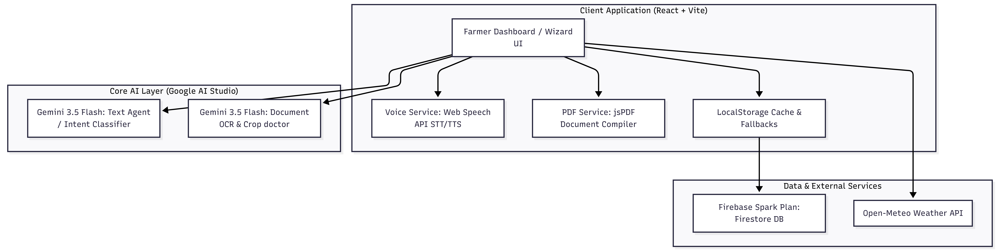
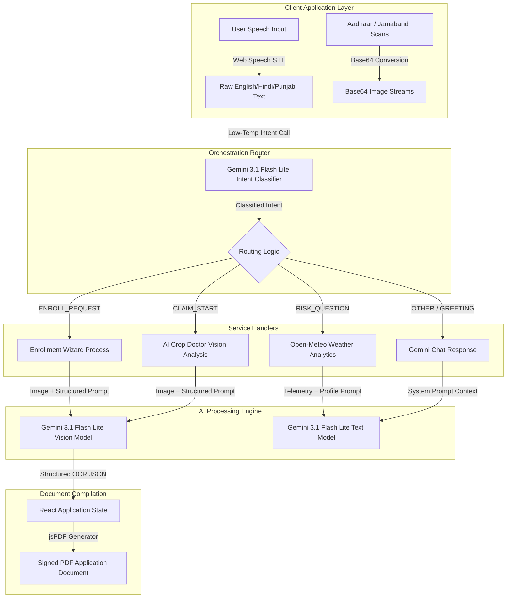
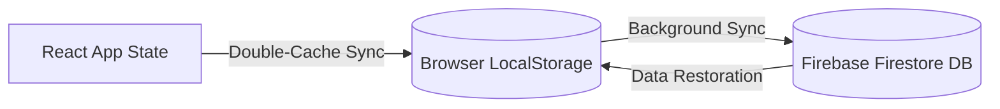

# KisanSaathi (ਕਿਸਾਨ ਸਾਥੀ | किसान साथी)
> Technical documentation and system architecture for the KisanSaathi agricultural AI companion.

KisanSaathi is an agentic AI companion designed for Indian farmers. It predicts localized agricultural risks, provides personalized crop insurance advisory, scans government documents via AI vision, and generates ready-to-submit official policy applications as PDFs—all via voice in Punjabi, Hindi, and English.

Designed mobile-first with zero paid APIs (running entirely on free tiers), it serves as a digital bridge to protect India's 146 million farmers from devastating crop losses.

---

## Live Demo and Production Builds

* **Live Demo URL:**[ [https://kisan-sathi.web.app](https://kisan-sathi-xi.vercel.app/)
* **GitHub Repository:** [https://github.com/arpit7007/Kisan-Sathi](https://github.com/arpit7007/Kisan-Sathi)
* **Video Demonstration:** [Link to Demonstration Video]

---

## System Architecture

The following diagram illustrates the high-level system architecture of the KisanSaathi application, showing how the client-side React UI interacts with the free API tiers, database services, browser-native APIs, and generative AI models:




---

## AI Architecture and Model Execution Pipelines

KisanSaathi coordinates multiple lightweight, free-tier models and browser APIs to execute complex agricultural intelligence tasks. Below is the detailed orchestration flow of user queries, base64 image data streams, and intent routing:



### 1. Zero-Typing Enrollment Pipeline
* **Step 1: Aadhaar OCR Analysis:** The user takes or uploads a photo of their Aadhaar card. The binary image is converted to a base64-encoded string and dispatched to Gemini 3.1 Flash Lite via the REST vision API. The model executes zero-shot OCR extraction, returning structured JSON containing `name`, `aadhaarNumber`, and `dob`.
* **Step 2: Jamabandi (official land revenue document that tracks property ownership, cultivation, and rights) Land Record OCR Analysis:** The user uploads their land record document. Gemini Vision extracts the `district`, `totalAcres`, and `landType` (irrigated or rainfed).
* **Step 3: Name Mismatch Cross-Validation:** To prevent fraud and application rejections, the application state controller executes a name-matching script comparing the extracted name from Aadhaar with the name on the Jamabandi record. If a difference is detected, a warning badge is rendered, alerting the farmer of the discrepancy prior to submission.
* **Step 4: Algorithmic Policy Recommendation:** A structured request containing the farmer's crop profiles and current district weather forecasts is sent to Gemini. It evaluates risk parameters (such as drought indices or pest warnings) to recommend either the yield-based PMFBY (Pradhan Mantri Fasal Bima Yojana) or the weather-based RWBCIS (Restructured Weather Based Crop Insurance Scheme).
* **Step 5: Client-Side PDF Generation:** The compiled data, including metadata and base64 document attachments, is parsed by the jsPDF engine. It compiles a two-page official application format, integrates signature spaces, embeds the scanned document images, and downloads the PDF directly onto the device.

### 2. Conversational Intent Routing and User Input Isolation
To guarantee robust operations when utilizing free-tier fallbacks, the system employs an input isolation routing strategy:
* The raw user query is separated from the larger instructions template using a distinct parsing marker.
* The system evaluates the raw text parameters to classify the query into one of seven enums: `RISK_QUESTION`, `POLICY_QUESTION`, `CLAIM_START`, `ENROLL_REQUEST`, `FARMING_ADVICE`, `GREETING`, or `OTHER`.
* This isolation prevents the AI model from matching options in the system prompt instructions, eliminating false-positive routing bugs.

### 3. Generative Agricultural Risk Synthesis
The risk scoring system updates dynamically using real-time meteorology:
* The system queries the Open-Meteo API for 14-day forecasts matching the coordinates of the farmer's district.
* It transmits a structured telemetry array (temperature trends, precipitation totals, humidity thresholds) to Gemini along with the farmer's crop type.
* The model analyzes the crop's threshold metrics (e.g. humidity bounds for cotton pests like Whitefly) to calculate a localized risk rating (0-100 score), outline top threats, and generate weekly sowing schedules.

---

## Data Management and Sync Architecture

KisanSaathi combines client-side caching with cloud synchronization to support offline-first operations in rural areas where network access may be unstable:



* **Local Storage Caching:** All onboarded farmer profiles and filed claims are cached instantly in the browser's LocalStorage.
* **Firestore Sync Layer:** When internet connectivity is active, data syncs automatically with Firestore using Firebase Spark anonymous authentication.
* **Graceful Degradation:** If cloud transactions fail or API limits are hit, the application falls back to local data and local mock models, ensuring uninterrupted service.

---

## Core Tech Stack

| Technology | Role | Tier & Pricing |
| :--- | :--- | :--- |
| **Vite + React 18** | Frontend Application Framework | Open-Source |
| **TailwindCSS** | Clean, Modern UI & Mobile Layouts | Open-Source |
| **Gemini 3.1 Flash Lite** | OCR, Intent Classification, Risk Assessment | Free Tier (60 RPM / 1500 daily requests) |
| **Web Speech API** | Punjabi & Hindi Speech-to-Text / Text-to-Speech | Free (Native Browser Engines) |
| **jsPDF** | Image embedding & filled application downloads | Open-Source |
| **Firebase Spark** | Firestore Database & Anonymous Auth | Free Tier (1GB DB size, 50k reads/day) |
| **Open-Meteo API** | 14-day weather forecasts | Free (No API Key Required) |

---

## Project Structure and Route Organization

* [App.jsx](file:///c:/Users/mailt/OneDrive/Desktop/KISAN%20SATHI/src/App.jsx): Registers application routes:
  * `/` : Landing portal with language preferences.
  * `/onboard` : Wizard onboarding profile (Name, District, Crops).
  * `/dashboard` : Core panel showcasing the Risk circular gauge, weather charts, and active claims.
  * `/enroll` : 4-step OCR scan wizard and PDF generator.
  * `/chat` : Voice agent conversation dashboard.
  * `/claim` : Crop damage assessment & filing page.
  * `/status` : Claim progress and countdown tracking screen.
* [gemini.js](file:///c:/Users/mailt/OneDrive/Desktop/KISAN%20SATHI/src/services/gemini.js): Houses Google Gemini AI integration.
* [pdf.js](file:///c:/Users/mailt/OneDrive/Desktop/KISAN%20SATHI/src/services/pdf.js): Controls PDF document structuring and image encoding.
* [firebase.js](file:///c:/Users/mailt/OneDrive/Desktop/KISAN%20SATHI/src/services/firebase.js): Handles database transactions.
* [voice.js](file:///c:/Users/mailt/OneDrive/Desktop/KISAN%20SATHI/src/services/voice.js): Orchestrates speech-to-text listener and text-to-speech outputs.

---

## How to Run Locally

### 1. Set Up Environment Variables
Create a `.env` file in the root directory and add the following keys:
```env
VITE_GEMINI_API_KEY=your_gemini_api_key
VITE_FIREBASE_API_KEY=your_firebase_api_key
VITE_FIREBASE_AUTH_DOMAIN=your_project_id.firebaseapp.com
VITE_FIREBASE_PROJECT_ID=your_project_id
VITE_FIREBASE_STORAGE_BUCKET=your_project_id.firebasestorage.app
VITE_FIREBASE_MESSAGING_SENDER_ID=your_sender_id
VITE_FIREBASE_APP_ID=your_app_id
```

### 2. Install Dependencies
```bash
npm install
```

### 3. Start Development Server
```bash
npm run dev
```
Open `http://localhost:5173` to run the application.

---

## Step-by-Step Judge Demonstration Script

To evaluate the application's capabilities, follow this verification workflow:
1. **Language Initialization:** Click "Start in Punjabi" on the Landing Page.
2. **Farmer Profiling:** On the onboarding screen, enter a name, choose **Mansa** district, choose **Cotton** crop, and select **No** for crop insurance.
3. **Risk Scoring Review:** Observe the circular **Risk Score Gauge** on the Dashboard. Cotton in Mansa will trigger a high threat level due to humidity and Whitefly pest warnings.
4. **Initiate Wizard:** Tap **Get Insurance** under Quick Actions.
5. **Document Scanner Execution:**
   - **Step 1 (Scan Aadhaar):** Upload a mock Aadhaar photo. Confirm the extracted name and DOB.
   - **Step 2 (Scan Land Record):** Upload a mock land record sheet. Check the extracted district and acreage details.
6. **Policy Recommendation:** On Step 3, listen to the voice companion recommend **RWBCIS** due to Mansa's high-humidity pest thresholds. Confirm and click Next.
7. **PDF Validation:** Click **Download Application PDF** on Step 4. Inspect the downloaded document containing your details and both scanned images.
8. **Claim Filing:** Navigate to **File a Claim**. Upload a crop damage photo to see Gemini analyze pest damage severity. Submit and review the 72-hour countdown timer in the active tracking list.
