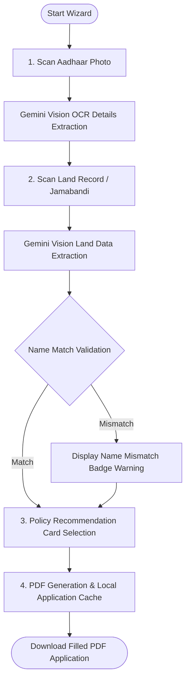

# KisanSaathi (ਕਿਸਾਨ ਸਾਥੀ | किसान साथी)
> **"Ek kaam karo, baaki sab KisanSaathi karega"** *(One action, KisanSaathi handles the rest)*

KisanSaathi is an agentic AI companion designed for Indian farmers that predicts localized agricultural risks, provides personalized crop insurance advisory, scans government documents via AI vision, and generates ready-to-submit official policy applications as PDFs—all via voice in Punjabi, Hindi, and English. Designed mobile-first with zero paid APIs (running entirely on free tiers), it serves as a digital bridge to protect India's 146 million farmers from devastating crop losses. The platform features an onboarding configuration wizard for farmer profiling; a live dashboard parsing 14-day Open-Meteo weather forecasts to calculate risk metrics, top threats, and sowing advice; a conversational voice chat interface utilizing browser-native speech recognition and synthesis for native language queries; a document scanning wizard that uses Gemini Vision to extract Aadhaar and Jamabandi details, cross-validates farmer names to detect mismatches, and suggests policies; a jsPDF generator compiling documents with embedded Aadhaar and land record image attachments; an AI crop doctor claim-filing process utilizing vision to assess crop damage severity; and an active claims tracker featuring a visual timeline, a 72-hour countdown clock, and a debug simulator to fast-track claim status for evaluation.

---

## System Architecture

The following diagram illustrates the system architecture of the KisanSaathi application, showing how the frontend, local storage caches, native Web APIs, and external free service layers interact:


```mermaid
graph TD
    subgraph Client Application (React + Vite)
        UI[Farmer Dashboard / Wizard UI]
        VoiceS[Voice Service: Web Speech API STT/TTS]
        PDFGen[PDF Service: jsPDF Document Compiler]
        LocalCache[LocalStorage Cache & Fallbacks]
    end

    subgraph Core AI Layer (Google AI Studio)
        GeminiText[Gemini 3.5 Flash: Text Agent / Intent Classifier]
        GeminiVision[Gemini 3.5 Flash: Document OCR & Crop doctor]
    end

    subgraph Data & External Services
        Firebase[Firebase Spark Plan: Firestore DB]
        OpenMeteo[Open-Meteo Weather API]
    end

    UI --> VoiceS
    UI --> PDFGen
    UI --> LocalCache
    UI --> GeminiText
    UI --> GeminiVision
    UI --> OpenMeteo
    LocalCache --> Firebase
```

---

## Hackathon Hero Demo (60-Second Zero-Typing Flow)

The primary feature designed for hackathon judges is the 60-Second Insurance Enrollment Wizard. The step-by-step document parsing, validation, and output compilation flow works as follows:



### Detailed Flow Steps
1. **Aadhaar Scan:** The farmer takes or uploads a photo of their Aadhaar Card. Gemini Vision OCR extracts their full name, 12-digit Aadhaar number, and date of birth, displaying it for confirmation.
2. **Land Record Scan:** The farmer uploads a photo of their Jamabandi/land record. Gemini Vision extracts the district, acreage, and irrigation type. It automatically cross-checks the name against the Aadhaar name and raises a warning in case of name mismatches.
3. **AI Policy Advisor:** KisanSaathi recommends either PMFBY (yield-based) or RWBCIS (weather-based) based on crop risk profiles. The agent speaks out the recommendation and reasoning in the farmer's native tongue.
4. **Instant PDF Generation:** The app compiles all details, embeds the scanned document photos, adds a signature block, and exports a signed application as `KisanSaathi_[FarmerName]_Application.pdf` using jsPDF.
5. **No Typing Required:** The farmer completes the entire government enrollment process using voice and camera in under 60 seconds.

---

## Key Features

* **Voice Companion:** Completely native text-to-speech and speech-to-text integration in Punjabi (Gurmukhi), Hindi (Devanagari), and English for conversational engagement.
* **Crop Risk Weather Dashboard:** Fetches live 14-day forecasts from the Open-Meteo API and passes data to Gemini to estimate localized risks (0-100 score), outline top threats (such as Whitefly in cotton), and output weekly sowing alerts.
* **AI Crop Doctor (Vision):** Analyzes uploaded crop damage photos using Gemini Vision. It detects pest attacks or diseases, reports severity, and checks policy coverage.
* **Claim Deadline Tracker:** Files claims into Firestore and tracks the crucial 72-hour claim notification window with a live countdown clock. Includes a "Fast-Track" debug button so judges can advance claim statuses through the pipeline.

---

## The Tech Stack (100% Free & Spark Tiers)

| Technology | Role | Tier & Pricing |
| :--- | :--- | :--- |
| **Vite + React 18** | Frontend Application Framework | Open-Source |
| **TailwindCSS** | Clean, Modern UI & Mobile Layouts | Open-Source |
| **Gemini 3.5 Flash** | OCR, Intent Classification, Risk Assessment | Free Tier (60 RPM / 1500 daily requests) |
| **Web Speech API** | Punjabi & Hindi STT / TTS | Free (Native Browser Engines) |
| **jsPDF** | Image embedding & filled application downloads | Open-Source |
| **Firebase Spark** | Firestore Database & Anonymous Auth | Free Tier (1GB DB size, 50k reads/day) |
| **Open-Meteo API** | 14-day weather forecasts | Free (No API Key Required) |

---

## Project Architecture & File Routing

* [App.jsx](file:///c:/Users/mailt/OneDrive/Desktop/KISAN%20SATHI/src/App.jsx): Registers application routes:
  * `/` : Landing portal with Punjabi/Hindi configuration.
  * `/onboard` : Wizard onboarding profile (Name, District, Crops).
  * `/dashboard` : Core panel showcasing the Risk circular gauge, weather charts, and active claims.
  * `/enroll` : 4-step OCR scan wizard and pdf generator.
  * `/chat` : Voice agent conversation dashboard.
  * `/claim` : Crop damage assessment & filing page.
  * `/status` : Claim progress and countdown tracking screen.
* [gemini.js](file:///c:/Users/mailt/OneDrive/Desktop/KISAN%20SATHI/src/services/gemini.js): Houses Google Gemini AI integration (with mock fallbacks).
* [pdf.js](file:///c:/Users/mailt/OneDrive/Desktop/KISAN%20SATHI/src/services/pdf.js): Controls PDF document structuring and image encoding.
* [firebase.js](file:///c:/Users/mailt/OneDrive/Desktop/KISAN%20SATHI/src/services/firebase.js): Handles database transactions (with local storage redundancy).
* [voice.js](file:///c:/Users/mailt/OneDrive/Desktop/KISAN%20SATHI/src/services/voice.js): Orchestrates speech-to-text listener and text-to-speech outputs.

---

## How to Run Locally

### 1. Set Up Environment Variables
Create a `.env` file in the root directory and add the following keys (fill in your free Gemini API and Firebase keys):
```env
VITE_GEMINI_API_KEY=your_gemini_api_key
VITE_FIREBASE_API_KEY=your_firebase_api_key
VITE_FIREBASE_AUTH_DOMAIN=your_project_id.firebaseapp.com
VITE_FIREBASE_PROJECT_ID=your_project_id
VITE_FIREBASE_STORAGE_BUCKET=your_project_id.firebasestorage.app
VITE_FIREBASE_MESSAGING_SENDER_ID=your_sender_id
VITE_FIREBASE_APP_ID=your_app_id
```

### 2. Install Dependencies
```bash
npm install
```

### 3. Start Development Server
```bash
npm run dev
```
Open `http://localhost:5173` to run the application.

---

## Quick Demonstration Guide for Judges

1. **Start:** Click "Start in Punjabi" on the Landing Page.
2. **Onboard:** Type a farmer name, choose **Mansa** district, choose **Cotton** crop, and select **No** for crop insurance.
3. **Dashboard:** Observe the circular **Risk Score Gauge** (Cotton in Mansa will trigger a high threat level due to humidity and Whitefly pest warnings).
4. **Get Insurance:** Tap **Get Insurance** under Quick Actions.
5. **Step 1 (Scan Aadhaar):** Upload a mock Aadhaar photo. Confirm the extracted name and DOB.
6. **Step 2 (Scan Land Record):** Upload a mock land record sheet. Check the extracted district and acreage details. 
7. **Step 3 (Advisory):** Listen to the voice companion recommend **RWBCIS** due to Mansa's high-humidity pest thresholds. Confirm and click Next.
8. **Step 4 (Download):** Click **Download Application PDF** to inspect the clean, beautifully laid out 2-page document containing all details and both scanned images.
9. **Claim Filing:** Navigate to **File a Claim**. Upload a crop damage photo to see Gemini analyze pest damage severity. Submit and review the 72-hour countdown timer in the active tracking list.
